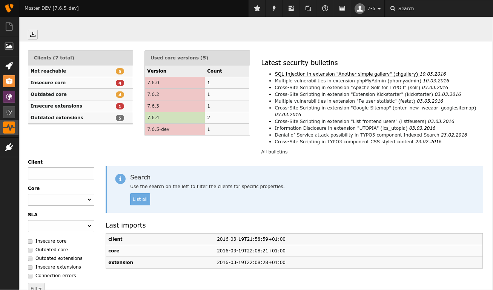
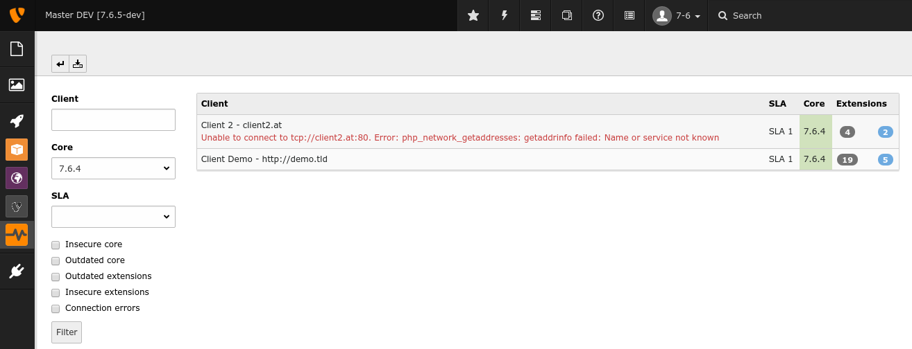
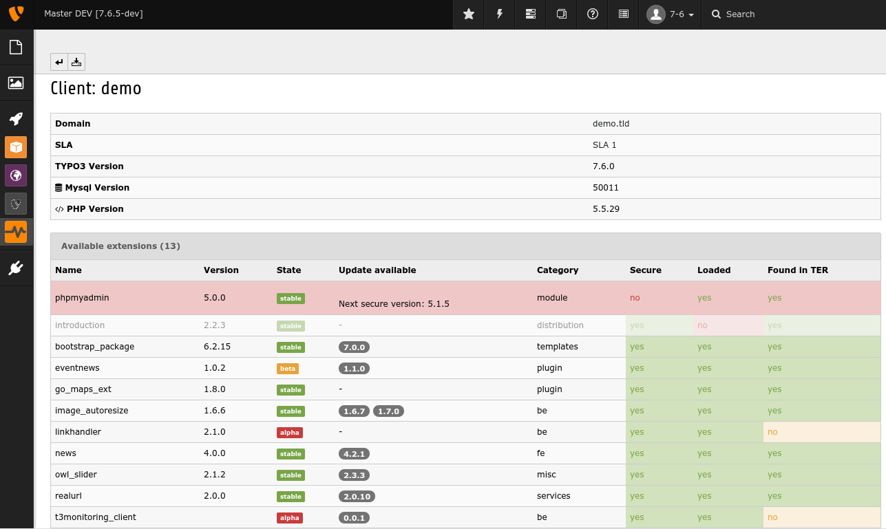
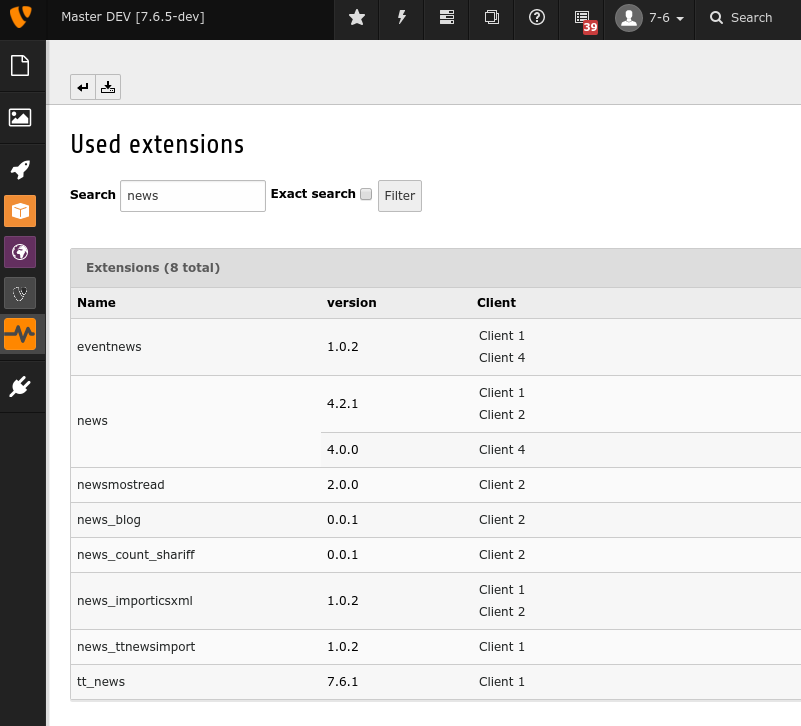

TYPO3 CMS Extension "t3monitoring"
==================================
This extensions provides the possibility to monitor all of your TYPO3 installations and shows you

- used TYPO3 version and if it is up to date
- available TYPO3 extensions and if those are installed, insecure or if there are bugfix, minor or major updates
- additional information like PHP & Mysql versions.

**Requirements**

- TYPO3 CMS 7 LTS (monitoring works also for 6.2 installations)

Important: This extension is still alpha and things might change!

Screenshots
^^^^^^^^^^^

**Overview**

**Search result**

**Single view of a client**

**List of all used extensions**

How to start
------------
Before you can actually monitor any installation, you need to install the extension *t3monitoring_client* on every installation (called "client").
This extension provides the day which will be fetched by the master installation. You can find this extension on github (https://github.com/georgringer/t3monitoring_client) or later in the TER.

Create the clients
""""""""""""""""""
Create a record "**Client**" on any sys folder and fill out at least the following required fields:

- Title
- Domain. Include ``http://`` or ``https://``.
- Secret: This is the same secret as defined in the configuration of *t3monitoring_client* in the client installation. Please don't reuse any secrets twice.

Create an optional record "**SLA**" to group your clients. Examples could be:

- VIP: Do all updates ASAP
- First ask: Before doing any updates, ask client for proper time schedule

Import the data
"""""""""""""""
To be able to deliver proper results, this extensions requires information about all core versions and all extensions. This information is provided by typo3.org.

To import the data, use the command line: ::

	./typo3/cli_dispatch.phpsh extbase monitoring:importAll

You can add this call also as task in the scheduler extension.

Especially the import of extensions can take a while, therefore you can use different calls for all required imports:

- ``./typo3/cli_dispatch.phpsh extbase monitoring:importCore`` to fetch latest core versions
- ``./typo3/cli_dispatch.phpsh extbase monitoring:importExtensions`` to fetch the extensions
- ``./typo3/cli_dispatch.phpsh extbase monitoring:importClients`` to fetch the client data

